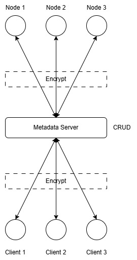

# Distributed File System (DFS)
## System Overview
A DFS is a file storage system that allows users to store, retrieve, and manage files across multiple machines while providing redundancy, fault tolerance, and scalability.

## Functional Requirements
### File Storage & Retrieval
- Upload and download files across distributed nodes.
- Support basic CRUD operations (Create, Read, Update, Delete).

### Distributed Storage
- Store files across multiple machines (or simulated nodes on a single machine).
- Implement chunking (split large files into smaller parts).

### Fault Tolerance & Replication
- Ensure redundancy by storing multiple copies of each file.
- Handle node failures gracefully (reconstruct lost data).

### Metadata Management
- Track file locations, chunk distribution, and replication.
- Maintain metadata on a central metadata server (or distributed using consensus protocols like Raft).

### Authentication & Access Control
- Basic user authentication (username/password or API key).
- Permissions for read/write access.

### Load Balancing & Scalability
- Distribute storage and retrieval requests evenly across nodes.

### Logging & Monitoring
- Log file operations and node health.

## Non-Functional Requirements
### Performance
- Optimize file transfers using multi-threading.
- Use efficient file chunking and compression techniques.

### Scalability
- Support horizontal scaling (add more storage nodes dynamically).

### Security
- Encrypt file transfers (TLS/SSL).
- Authenticate users before allowing access.

### Reliability
- Implement failure recovery mechanisms.
- Store redundant copies of metadata.

## Tech Stack
### Backend (C++)
- Networking: gRPC, ZeroMQ, or custom TCP/UDP sockets.
- Storage Management: SQLite, LevelDB, or simple file-based storage.
- Concurrency: Boost.Asio, C++ STL threads.

### Frontend (C#)
- GUI Framework: WPF or WinForms.
- API Calls: RESTful or gRPC communication with backend.
- File Explorer UI: Drag-and-drop file uploads, progress bars.

### Other Tools
- Version Control: GitHub/GitLab.
- Containerization (Optional): Docker for running nodes in isolated environments.
- Testing: GoogleTest for C++, xUnit for C#.

